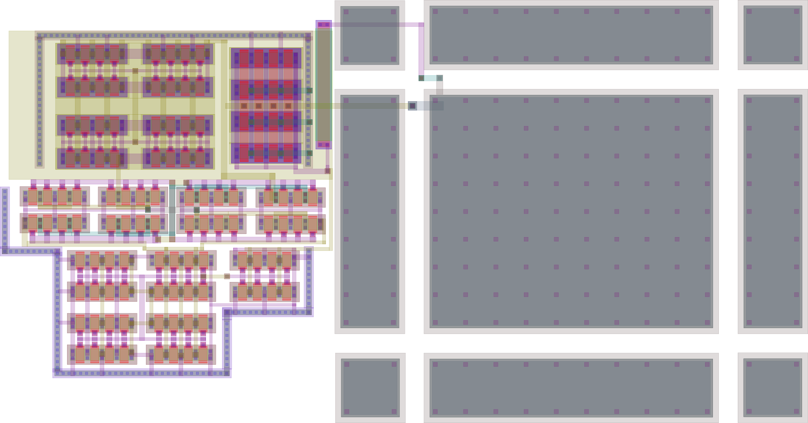
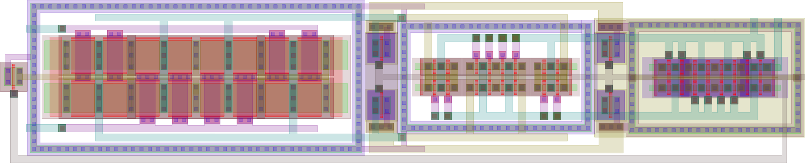

# icLayoutRender
<!--
*** Thanks for checking out this README. If you have a suggestion
*** that would make this better, please fork the repo and create a pull request
*** or simply open an issue with the tag "enhancement".
*** Thanks again!  :D
***
***
-->

<!-- PROJECT SHIELDS -->
<!--
*** I'm using markdown "reference style" links for readability.
*** Reference links are enclosed in brackets [ ] instead of parentheses ( ).
*** See the bottom of this document for the declaration of the reference variables
*** for contributors-url, forks-url, etc. This is an optional, concise syntax you may use.
*** https://www.markdownguide.org/basic-syntax/#reference-style-links
-->
[![Contributors][contributors-shield]][contributors-url]
[![Forks][forks-shield]][forks-url]
[![Stargazers][stars-shield]][stars-url]
[![Issues][issues-shield]][issues-url]
[![GNU License][license-shield]][license-url]


<!-- PROJECT LOGO -->
<br />

Having a high quality layout image for publishing is a painfull process. Unfortunatelly, usually published layouts have poor quality, very difficult to read and understand what is going on from the schematics. This library intends to make this process as straight forward as possible. By inputing a *.gds file and a layer color *.map the script outputs a *.tex and a *.pdf file ready for publication.


## IC Layout Render: a Step-by-Step Approach

### Generating a GDS File on CADENCE Virtuoso 

Open the Virtuoso Window, and go to File->Export->Stream

Configure the stream file to be: cellName.gds

Select your library and the topcell to be exported
  - Library: Mylib
  - Cell: cellName
  - View: Layout

Click **Apply**

### LayerColor File

The LayerColors.map file is created for a specific Process Design Kit (PDK)

If the available PDK has the layers:
- diffusion is lime,
- poly-Si is red, 
- n-type implantation is gold, 
- p-type implantation is pink...

File format is:

- GDSNumber!Layer!Collor
- 4!DIFF!{rgb:red,0;green,255;blue,0}
- 5!POLY!{rgb:red,255;green,0;blue,0}
- 6!NIMP!{rgb:red,217;green,204;blue,0}
- 7!PIMP!{rgb:red,255;green,191;blue,242}

### Creating LayerColors file

Obtain the GDS layer number using 
  > Technology Tool Box->Manager->Dump…->Save

The layer numbers can also be obtained when exporting the .gds file as shown on the image bellow:


Obtain the colors from Virtuoso layout using
  > Display Resources Tool Box->Edit->File->Save


Compare the *.tf file and the *.drf to be sure that the layer number, name and color are correct mapped.

Write a new layerColors_PDK.map according to the example. Be aware that missing layers will be neglected

```bash
  python3 icLayoutREnder.py
  Please enter the cell name: **INPUT FILE** 
  Please enter the layer colors: **LayerColor** 
```
For some help please refer to
```bash
  python3 icLayoutRender.py -h
  Usage: icLayoutRender.py -g <cellNameFile> -m <layerColorsFile>
  For pdfTex compiler do: icLayoutRender.py -X -g <cellNameFile> -m <layerColorsFile>
```
   
## Installation

### Linux
Please first make sure that python 3 is installed on your machine with the devel extension, otherwise please run

For CentOs:
```bash
  sudo yum install python3-devel
```
For Ubuntu:
```bash
  sudo apt install python3-devel
```
#### Dependencys Installation

```bash
  python -m pip install --user gdspy
  python -m pip install pandas
  python -m pip install:l git+https://github.com/Aypac/GDSLatexConverter.git
```
#### Installing TeXLive

```bash
  cd /~
  mkdir TeXLiveInstall
  cd TeXLiveInstall
  wget https://mirrors.chevalier.io/CTAN/systems/texlive/tlnet/install-tl-unx.tar.gz
  tar -xzvf install-tl-unx.tar.gz
  cd install-tl
  pearl install-tl -gui
```

Installation is completed at /usr/local/texlive/2021
Please check if the 2021 version is installed in the default path using

```bash
tex --version
```

### Windows

Please first make sure that ```PYTHON_INSTALLATION_FOLDER/include``` is in your PATH. 

Download the precompiled release of [gdspy](https://github.com/heitzmann/gdspy/releases)

Once downloaded open your command prompt

```cmd 
cd *DOWNLOAD_PATH*
python -m pip install ****.whl
python -m pip install pandas
pip install git+https://github.com/Aypac/GDSLatexConverter.git
```
For installing latex compiler we sugest [MiKTeX](https://miktex.org/download) 


## Layout Illustrations using icLayoutRender

### Miller Operational Transconductance Amplifier


### Strong Arm Comparator



<!-- ROADMAP -->
## Roadmap

See the [open issues](https://github.com/DrPiBlacksmith/icLayoutRender/issues) for a list of proposed features (and known issues).


<!-- CONTRIBUTING -->
## Contributing

Contributions are what make the open source community such an amazing place to learn, inspire, and create. Any contributions you make are **greatly appreciated**.

1. Fork the Project
2. Create your Feature Branch (`git checkout -b feature/AmazingFeature`)
3. Commit your Changes (`git commit -m 'Add some AmazingFeature'`)
4. Push to the Branch (`git push origin feature/AmazingFeature`)
5. Open a Pull Request


<!-- LICENSE -->
## License

Distributed under the GNU AGPL-3.0 License. See `LICENSE` for more information.


<!-- CONTACT -->
## Authors

- [J. R. R. O. Martins](https://www.github.com/Rapos0) - jrraposo1@gmail.com
- [Pietro M. Ferreira](https://www.github.com/DrPiBlacksmith) - maris@ieee.org


Project Link: [https://github.com/DrPiBlacksmith/icLayoutRender](https://github.com/DrPiBlacksmith/icLayoutRender)


<!-- ACKNOWLEDGEMENTS -->
## Acknowledgements
* [GDSLatexConverter](https://github.com/Aypac/GDSLatexConverter)


  
[contributors-shield]: https://img.shields.io/github/contributors/DrPiBlacksmith/icLayoutRender.svg?style=for-the-badge
[contributors-url]: https://github.com/DrPiBlacksmith/icLayoutRender/graphs/contributors
[forks-shield]: https://img.shields.io/github/forks/DrPiBlacksmith/icLayoutRender.svg?style=for-the-badge
[forks-url]: https://github.com/DrPiBlacksmith/icLayoutRender/network/members
[stars-shield]: https://img.shields.io/github/stars/DrPiBlacksmith/icLayoutRender.svg?style=for-the-badge
[stars-url]: https://github.com/DrPiBlacksmith/icLayoutRender/stargazers
[issues-shield]: https://img.shields.io/github/issues/DrPiBlacksmith/icLayoutRender.svg?style=for-the-badge
[issues-url]: https://github.com/DrPiBlacksmith/icLayoutRender/issues
[license-shield]: https://img.shields.io/github/license/DrPiBlacksmith/icLayoutRender.svg?style=for-the-badge
[license-url]: https://choosealicense.com/licenses/agpl-3.0
[linkedin-shield]: https://img.shields.io/badge/-LinkedIn-black.svg?style=for-the-badge&logo=linkedin&colorB=555
[linkedin-url]: https://linkedin.com/in/othneildrew