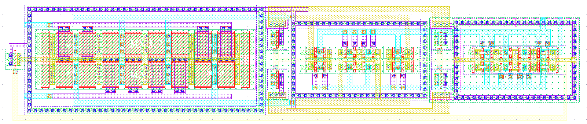
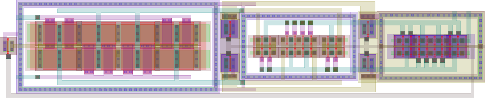
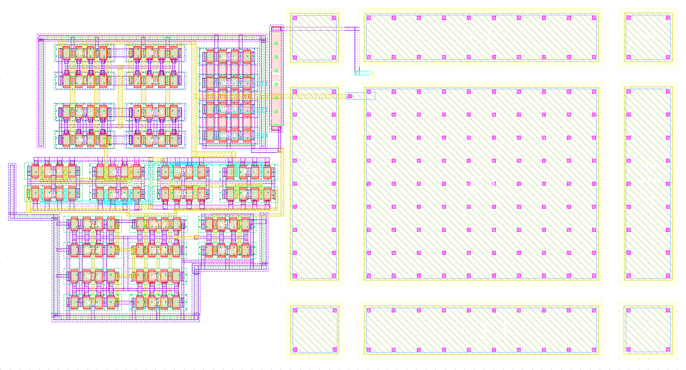
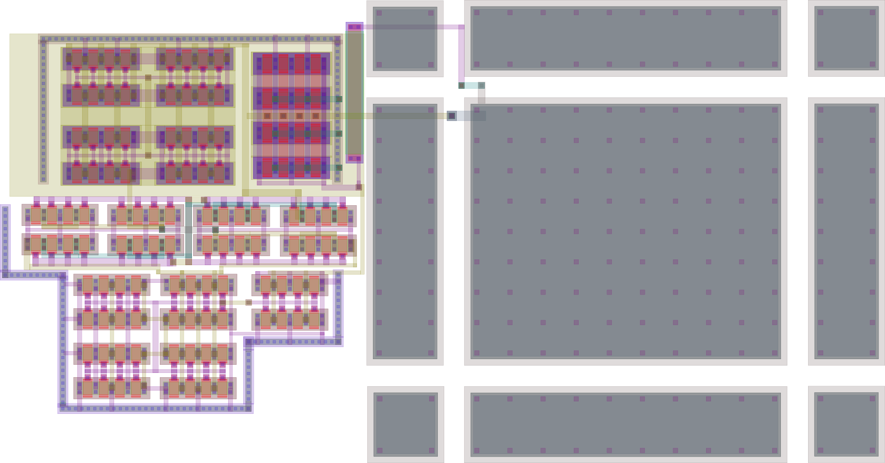

# Summary

Graphic Design System (GDSII) from [@Calma1987] is a common database file format to stream out integrated circuit (IC) masks, also called layout, before fabrication. Being an essential part of circuit development, designers are often familiarized in how to generate this binary file on computer-aided design (CAD) tools. This output file contains planar geometric shapes which represent physical 3D layers from a specific process design kit (PDK). Commercial PDK usually presents more than 50 layers, which are 2D visualized in CAD tools. 

Reading a layout in those CAD tools is not a simple task, however high-quality graphical image is available in such tool. Thus, an IC designer is capable to understand the data representation and point out improvements for the IC. Nevertheless, IC documentation is often delivered in a lower quality 2D image depicted in a PDF file. Once the PDF is generated; the circuit layout becomes hardly readable even for experienced IC designers.

Scientific communications require accurate and repeatable results to be considered prior publication. In microelectronics research field, a layout picture is mandatory. While illustrations should be a vectorial graph like, IC layout is often depicted from a low-quality bitmap obtained from a screenshot or an image saving through the CAD tool. In this scenario, having an accurate, readable, and reproducible layout result is a challenge. Most publications illustrate IC layouts in lower standards than the other illustration results, which hinds the required physical solution to address state-of-the-art IC performance.

The tool icLayoutRender aims to a user-friendly transcription of a GDSII file in a pdf file. Developed in Python 3, the image rendering requires an input GDSII file <cellName.gds> and the PDK layer color file <LayerColor_PDK.map> to produce an output PDF file <cellName.pdf>. The GDSII layers will be rendered using the available PDK layer colors. Missing layers will be neglected.

The tool icLayoutRender does:
1. confirm the entered values;
2. item convert the *.gds to a *.tex file;
3. call LuaTeX or pdflatex to generate a *.aux, and *.pdf.

The tool icLayoutRender requires:
1. Python3 installed with devel options;
2. gdspy, pandas, math, and GDSLatexConverter [@Vollmer2020] Python libraries installed;
3. TexLive for a Linux installation, or  MikTEX for a Windows installation;
4. tikz LaTEX package to compile the output *.pdf  file.

Several examples using icLayoutRender are freely available on the official website. Layer color file generation is also explained in the user manual, as installation procedure and the tool operation in Linux and Windows. 
The icLayoutRender image rendering tool has been used in recent scientific communication [@Martins2021] and the illustration readability is remarkable.

# Overview of icLayoutRender tool

<<<<<<< HEAD
In commercial CAD tools, the GDSII file is obtained following a common procedure File->Export->Stream. The output stream file should be named as <cellName.gds> and selected as the top cell to be exported from an available layout. The GDSII file should be saved in the same folder as the proposed tool for a user-friendly operation.

The LayerColors.map file is created for a specific PDK. Commercially available PDK, as [@XFAB2019], has the layers: diffusion in lime, poly-Si in red, n-type implantation in gold, p-type implantation in pink, and others. The layer color file format is depicted in the following code.

\begin{verbatim}
```MatLab
GDSNumber!Layer!Collor
4!DIFF!{rgb:red,0;green,255;blue,0}
5!POLY!{rgb:red,255;green,0;blue,0}
6!NIMP!{rgb:red,217;green,204;blue,0}
7!PIMP!{rgb:red,255;green,191;blue,242}
```
\label{ver:LayerMAP}
\end{verbatim}

One may notice that lime, red, gold, and pink colors are represented in RGB color code. GDS layer number and name are available in the PDK layer map file (see Fig. 1(a)), while the color and its code are obtained in the technology file (see Fig. 1(b)). A user-friendly layer window (LSW) is often available aid both files translation in the requested LayerColors.map. 
One may implement an automation tool for such translation. However, this procedure is only run once per PDK. GDS number, layer name, and color do not change between different PDK versions. Moreover, CAD tools usually uses the color code proposed in the example. Thus, this procedure is only required in the installation of a new PDK. The GDS number is the data that mostly change between different PDK files. The layer colors are usually simmilar in commercial PDK as in [@XFAB2019].

|![Checking layer numbers in a commercial PDK as [@XFAB2019]. \label{fig:LayerNumbers}](img/LayerNumbers.png)|![Checking layer collors in a commercial PDK as [@XFAB2019]. \label{fig:LayerColors}](img/LayerColors.png)|
| :----: | :----: |
|(a) |(b)|

| Fig. 1. Layer colors map creation using a  commercial PDK as [@XFAB2019], where one can verify (a) the layer numbers and (b) the layer colors.|
| --- | 

To prove the advantage of using icLayoutRender tool, the authors have rendered the IC layout known as StrongArm latched comparator and proposed in [@Fonseca2017]. The original image file is reproduced in Fig 2(a) using a grey color scale. Figure 2(b) depicts the same IC layout rendered by the proposed tool using gray scaled version of the rendering. A full color version of this example is depicted in Fig. 3(a). Figure 3(b)  IC layout rendered by the proposed tool in full color map.

|![Original StrongArm latched comparator layout proposed in [@Fonseca2017]. \label{fig:SA_Fonseca}](img/SA_Fonseca.png) ||
| :----: | :----: |
|(a) |(b)|

| Fig. 2. Layout illustration of StrongArm latched comparator proposed in [@Fonseca2017] (a) as its original illustration and (b)  using IC layout render tool with gray scale color map.|
| --- | 

| | |
| :----: | :----: |
|(a) |(b)|

| Fig. 3. Layout illustration of StrongArm latched comparator proposed in [@Fonseca2017] (a) in full collor version and (b) using IC layout render tool with a full color map.|
| --- | 

Another common example depicted in scientific papers is the operational amplifier. Figure 4(a) illustrates an layout example of an amplifier known as OTA Miler [@Ferreira2019b] in its full color version. One may observe the readibility improvements in Fig. 4(b), where IC Layout Render tool is used.

| | |
| :----: | :----: |
|(a) |(b)|

| Fig. 4. Layout illustration of original OTA Miler amplifier layout proposed in [@Ferreira2019b] (a) in full collor version and (b) using IC layout render tool with a full color map.|
| --- | 

# Conclusion
Scientific communications require accurate and repeatable results, where microelectronics research field requires a high-quality layout illustration. The proposal demonstrated a user-friendly tool to a GDSII transcription in a vectorial graph quality image saved as a pdf file. All illustration examples in this work were obtained from an IC design using the PDK of [@XFAB2019]. However, layer maps can be easily adapted to any commercial PDK. One may assert the illustration quality by increasing zoom over Fig. 2, 3 and 4 in the fpdf file or by printing them in a poster sized version. The vectorial graphical rendering is obtained by the proposal in which standard tools are unable to attain. 

# References

Calma Company. (1987). *GDSII™ Stream Format Manual* (February).
http://bitsavers.informatik.uni-stuttgart.de/pdf/calma/GDS_II_Stream_Format_Manual_6.0_Feb87.pdf

Ferreira, P. M., Martins, J. R. R. O., Mostafa, A., \& Juillard, J.
(2019). Process-Voltage-Temperature Analysis of a CMOS-MEMS Readout
Architecture. *Proc. IEEE Design, Test, Integration \& Packaging
of MEMS/MOEMS*, 1--4. https://doi.org/10.1109/DTIP.2019.8752699

Fonseca, A. V., Khattabi, R. E., Afshari, W. A., Barúqui, F. A. P.,
Soares, C. F. T., \& Ferreira, P. M. (2017). A Temperature-Aware
Analysis of Latched Comparators for Smart Vehicle Applications.
*Proc ACM IEEE Symp. Integr. Circuits Syst. Design*, 1--6.
https://doi.org/10.29292/jics.v13i1.8

Martins, J. R. O. R., Alves, F., \& Ferreira, P. M. (2021). A 237 ppm /
◦ C L-Band Active Inductance Based Voltage Controlled Oscillator in SOI
0 . 18 µm}. *Proc ACM IEEE Symp. Integr. Circuits Syst. Design*,
1--6. https://doi.org/10.1109/SBCCI53441.2021.9529990

Vollmer, R. (2020). *GDSLatexConverter*.
https://github.com/Aypac/GDSLatexConverter


XFAB Mixed-Signal Foundry Experts. (2019). *XH018 - 0.18 Micron
Modular Analog Mixed HV Technology* (pp. 1--22).
https://www.xfab.com/technology/cmos/018-um-xh018/

# To cite this work
João R. R. O Martins and Pietro M. Ferreira,, (2021). IC-Layout
Render: Image rendering tool for integrated circuit layout in
Python. *Open Source Software*. https://doi.org/0.5281/zenodo.5618268
